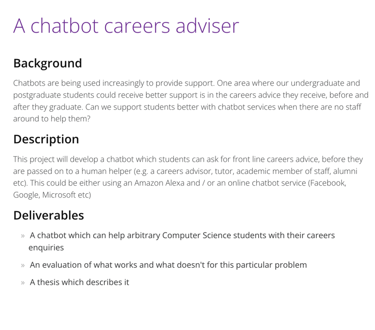

# "A Chat bot careers advisor" Project Details

###  Project Specification

### Related Paper Links
1. [The Rise of Social Bots - Emilio Ferrara](https://papers.ssrn.com/sol3/papers.cfm?abstract_id=2982515)
2. [ELIZA—a computer program for the study of naturallanguage communication between man and machine - J. Weizenbaum](https://dl.acm.org/doi/10.1145/365153.365168)
3. [Messaging apps are now bigger than social networks](https://www.businessinsider.com/the-messaging-app-report-2016-4-23?r=US&IR=T)
4. [Review_on_Chatbot_Design_Techniques_in_Speech_Conversation_Systems - D. J. W. Sameera A. Abdul-Kader](https://www.researchgate.net/publication/329147103_)
5. [Pandorabots](https://en.wikipedia.org/wiki/Pandorabots)
6. [M. Ward]()
